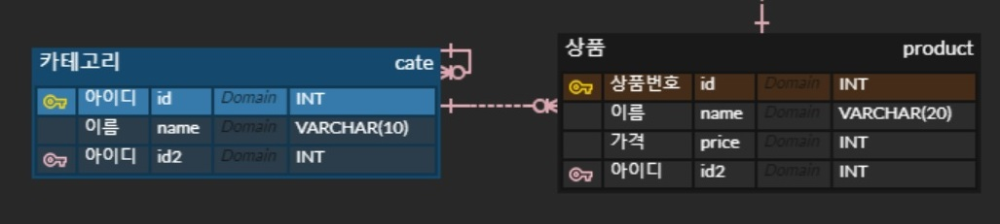
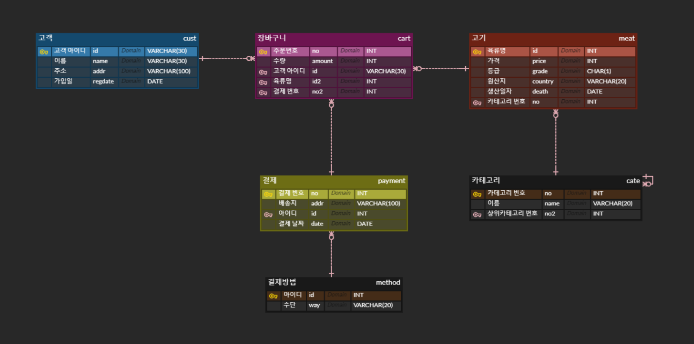

# Day19

- 2022-05-03

- 교과서: 이것이 mySQL이다.

  - DB 정의

  - 테이블에 데이터 넣기

  - 데이터를 원하는 모습으로 보여주기

- 조별 WS: 쇼핑몰의 종류를 정해 DB ERD까지 만들기 


## 개요

CH.08 테이블과 뷰 (P311~)

1. [테이블 만들기](#Table만들기) - P320
   
   - [SCHEMA 만들기](#SCHEMA만들기)
   - [테이블 정의](#테이블정의)
   - [테이블에 제약조건 넣기](#제약조건) - P325
   
2. [테이블 삭제](#테이블삭제) - P342

3. [테이블 수정](#테이블수정) - P342

4. [*VIEW 테이블](#VIEW) - P345

   - [수정 못하는 경우](#수정불가) - P361
   - [VIEW의 장점](#장점) - P356

5. 조별 WS: 쇼핑몰 DB 디자인

   - [ERD](#WS)

   - [ERD 수정 버전](#수정)

     

## CODES

1. [shoppingdb_DDL](./shoppingdb_DDL.sql)
   - DB와 Table만들기
   - Table에 제약조건
2. [shoppingdb_DML](./shoppingdb_DML.sql)
   - 제약조건 실험하기
   - VIEW table 만들기


## Table만들기

- Workbench는 mysql에만 있으므로 DOS와 SQL문을 사용하여 만들기를 습관화하자.

### SCHEMA만들기

- DOS 명령어

  - 접속

    ```sql
    mysql -u admin1 -p
    ```

  - Schema 만들기

    ```sql
    CREATE SCHEMA SHOPPINGDB;
    ```

  -  그 외

    - ```sql
      SHOW DATABASES;
      ```

    - ```sql
      SHOW TABLES;
      ```

    - 이동

      ```sql
      USE SHOPDB;
      ```

    - 테이블 칼럼 보기

      ```sql
      DESC item;

    - 위아래 화살표 누르면 그 전에 썼던 문들이 다 나와서 선택가능.


### 테이블정의

- 카테고리 안에서도 세부 카테고리 구현하는 방법
  - cate tbl
    - '의류'라는 카테고리 안에 '바지'-> 긴바지, 반바지, etc.
    - SELF JOIN을 쓴다.




- FOREIGN KEY가 될 필드를 만들어 놓는다

  ```sql
  -- cart table
  -- uid와 pid는 FOREIGN KEY로 지정될 것.
  CREATE TABLE cart(
  	id INT,
      uid VARCHAR(10),
      pid INT,
      regdate DATE
  );
  ```

- 테이블을 만들고 지우는 순서 중요

  - FOREIGN KEY가 먼저 지워지도록 해야 한다.


### 제약조건

- 테이블 생성 후 제약조건을 지정한다.
- ***ALTER*** keyword

```sql
   1. PRIMARY KEY
   		ALTER TABLE cust
		ADD CONSTRAINT PRIMARY KEY (id);
		
   2. FOREIGN KEY
      - ON DELETE CASCADE
      - ON UPDATE CASCADE
      	ALTER TABLE cart 
		ADD CONSTRAINT FOREIGN KEY (uid) REFERENCES cust(id)
		ON DELETE CASCADE
		ON UPDATE CASCADE;
		
   3. AUTO_INCREMENT
   		ALTER TABLE product MODIFY id INT AUTO_INCREMENT;
		ALTER TABLE product AUTO_INCREMENT = 1000;
		
   4. UNIQUE
      - 중복되지 않은 유일한 값을 입력
      - Null 값을 허용하는게 primary key와 다른 점.
      	ALTER TABLE cate
		ADD CONSTRAINT UNIQUE (name);
		
   5. NULL/ NOT NULL
   
   6. CHECK
   		ALTER TABLE product ADD CONSTRAINT CHECK (price > 0);
   		
   7. DEFAULT
      - 값이 입력되지 않았을 때 들어갈 기본값 설정.
      	ALTER TABLE cust
   		ALTER COLUMN addr SET DEFAULT 'Seoul';

```

   

## 테이블삭제

```sql
DROP TABLE tableName;
```


## 테이블수정

- ***ALTER TABLE***문을 사용한다

- **ON UPDATE CASCADE / ON DELETE CASCADE**

  - 기준 테이블의 데이터가 변경되었을 때 외래 키 테이블도 자동으로 적용되도록 설정.

  - 별도 지정 없을 시, ON UPDATE NO ACTION / ON DELETE NO ACTION 즉, 회원 테이블의 회원 아이디가 변경되어도 아무렁 일이 일어나지 않음.

  - 평소 PRIMARY KEY가 바뀔 일이 없으므로 UPDATE는 잘 안쓰임.

  ```sql
    ALTER TABLE cart 
    ADD CONSTRAINT FOREIGN KEY (uid) REFERENCES cust(id)
    ON DELETE CASCADE
    ON UPDATE CASCADE;
    
    -- 활용
    DELETE FROM cust WHERE id = 'id01';
    UPDATE cust SET id='id001' WHERE id='id01';
  ```

- 열 추가

    ```sql
    ALTER TABLE tableName
    ADD name VARCHAR(30) NULL;
    ```

- 열 삭제

	```sql
	ALTER TABLE tableName
	DROP COLUMN name;
	```

​																													[위로](#Table만들기)

---

## VIEW

- SELECT로 만든 내가 원하는 결과표를 VIEW 테이블로 저장해놓고 쉽게 꺼내 볼 수 있다.

	```sql
	CREATE VIEW v_cart
	AS
	SELECT ca.id, c.id AS uid, c.name AS uname, p.id AS pid, 
	p.name AS pname, p.price, ct.name AS ctname, ca.regdate 
	FROM cart ca
	INNER JOIN cust c ON ca.uid = c.id
	INNER JOIN product p ON ca.pid = p.id
	INNER JOIN cate ct ON p.cid = ct.id;
	```


- VIEW를 바꾸면 진짜 테이블의 값도 바뀐다.

	```sql
	-- 1. data가 바뀌면 view도 바뀜.
	UPDATE cart SET regdate= '2020-05-03' WHERE id = 1000;
	SELECT * FROM v_cart;
	
	-- 2. view tbl을 업데이트해도 cart tbl이 바뀐다.
	UPDATE v_cart SET regdate= '2019-05-03' WHERE id = 1000;
	```


### 수정불가

- 뷰를 통해서 테이터의 수정이나 삭제가 불가한 경우

  	- 집계함수를 사용한 뷰
  	- UNION ALL, JOIN 등을 사용한 뷰
  	- DISTINCT, GROUP BY 들을 사용한 뷰

  

### 장점

- 보안에 강함
- 복잡한 쿼리의 단순화


---

## WS

- 쇼핑몰 주제 선정 후 ERD 만들기
  		- Point. 한번 주문에 여러 물건을 주문 가능.




### 수정

- 주문이라는 계약서가 제일 중요
  - 주문상세 - 하나의 주문에 여러 제품

- 장바구니

  - 주문에다가 정보를 보낸 뒤 사라짐.

.png)


​																												[맨위로](#Day19)
