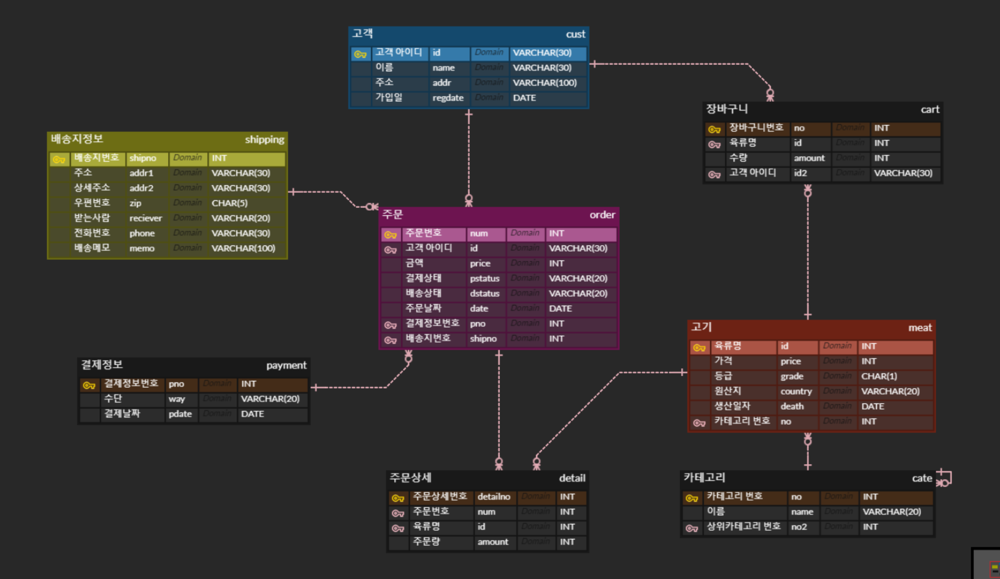
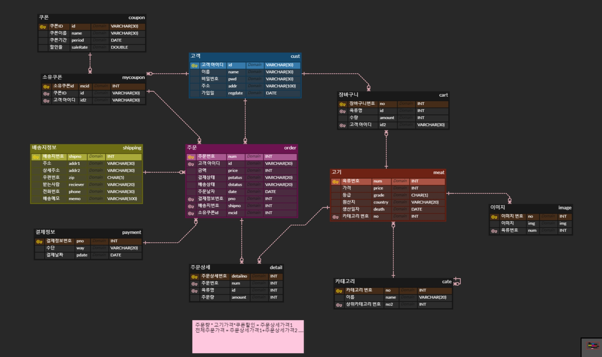
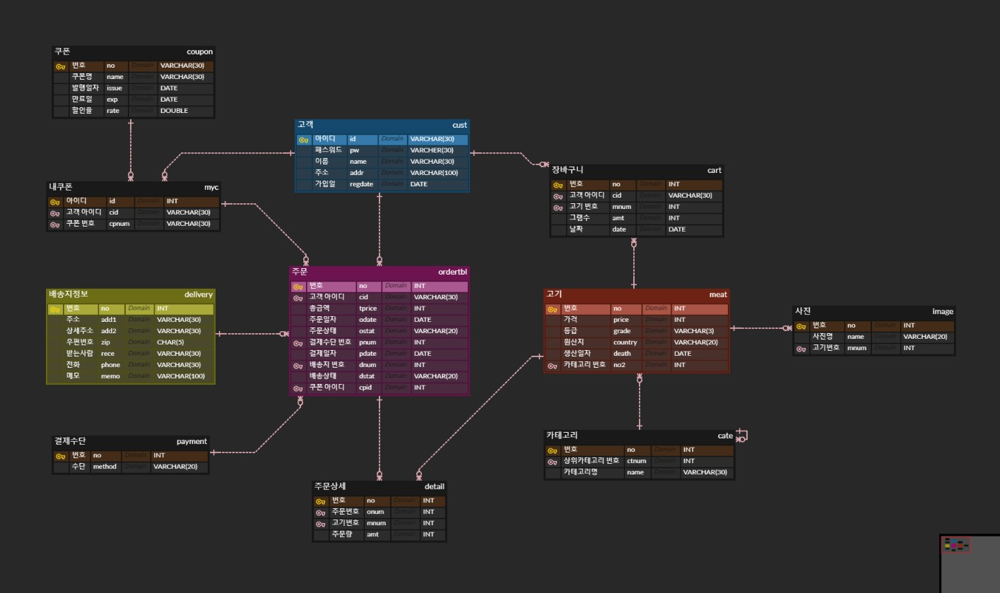

# Day20

- 2022-05-04

- WS: ButcherShop

  


## 개요


1. [ButcherShop](#ButcherShop) WS ERD review
2. [DDL 만들기](#DDL)
3. [DML 만들기](#DML)
   - VIEW 테이블

----------

​	[도전과제]

4. 다양한 조회

5. JAVA - JDBC --> CRUD
   - 이번주 연습


## ButcherShop


### ERD Review


#### General

- ERD에는 흐름이 없다 -> 데이터를 받아서 저장하는 공간.

- ERD는 개발 중에도 시시각각 바뀔 수 있다.
- DB가 변경된다는 것은 시스템 개발에 치명적.
  - --> 하지만, 완벽한 ERD를 개발전에 만들 수 없다.
  - ==> 시스템을 여러 번 만들어 본 노하우가 필요하자.
- ERD는 FM, 개발에서 모든 테이블을 만들 필요는 없다.
  - JOIN으로 대처하자
  - ==> **View Table** 세팅해 놓기.
- !!! **계약서**가 아주 중요 (모든 판매 관련)
  - 주문 테이블 (쇼핑몰)
- 보통 테이블에 **날짜**를 넣자
  - 언제 무엇을 했는지가 중요


#### ERD

- **Day19 ButcherShop ERD (V2)**

  




- 고려목록

  - 고객 테이블 

    - 패스워드

  - 쿠폰

    - 쿠폰 테이블,  고객이 소유한 쿠폰 리스트 테이블(다수의 쿠폰 소유를 위해 -> 장바구니 같은 것)
    - --> 고객 테이블에 이어져 있어야 할 것

  - 추천, 관심목록, 관심종목 (optional)

    - --> 사람들이 클릭했던 것은 db가 아니라 파일시스템으로 저장 

    - => 추천상품 테이블을 만들 필요x

  - 사진

    - 이름 - 실제 이미지 파일은 다른 곳에 저장
    - 별도의 테이블로 생성

  - 주문

    - 배송지 정보와 결제정보는 논리적으로는 분리 되어있지만 실제 개발할 때는 주문에 합쳐서 하는 경우 많음

    

  - 사담: 햄버거집 DB 엄청 어렵다 -> 재조립 많아서  (피자집, 서브웨이 등)


- **After editing**

  

  

  

- **NOTE:**

  - 쿠폰
    - 한 고객이 다수의 쿠폰을 가지고 있으려면 mycoupon을 만들어야 하면 이 테이블이 고객 테이블의 PK를 가지고 있어야 한다. (Ex. 장바구니)
  - 이미지
    - 이미지도 쿠폰과 같이 한 고기상품 당 여러 개의 이미지를 가질 수 있으므로 이미지 테이블이 고기 PK를 가진다.


- **ButcherShop v4 - 내 버전**

  

  

  

  - Edit
    - 고기와 주문테이블에 있는 가격의 type이 Double로 바뀜.


​																																							[위로](#ButcherShop)

---


### DDL

- **WARNING**

  ```
  1. DROP TABLE order
  2. TABLE CREATION order
  ```

- **ORDER**

  ```sql
  -- 1. NULL
  -- 2. PRIMARY KEY
     		ALTER TABLE cust
    		 ADD CONSTRAINT PRIMARY KEY (id);
  -- 3. FORIEGN KEY
     		ALTER TABLE cart 
    		ADD CONSTRAINT FOREIGN KEY (uid) REFERENCES cust(id)
    		ON DELETE CASCADE
     		ON UPDATE CASCADE;
  -- 4. AUTO_INCREMENT
     		ALTER TABLE product MODIFY id INT AUTO_INCREMENT;
     		ALTER TABLE product AUTO_INCREMENT = 1000;
  -- 5. UNIQUE
     		ALTER TABLE cate
     		ADD CONSTRAINT UNIQUE (name);
  -- 6. CHECK
     		ALTER TABLE product ADD CONSTRAINT CHECK (price > 0);
  -- 7. DEFAULT (NOT NULL 있어야 함)
     		ALTER TABLE cust
     		ALTER COLUMN addr SET DEFAULT 'Seoul';
  ```


- **NOTE:**

  - FK

    - PK가 바뀔 일이 거의 없기 때문에 ON UPDATE CASCADE는 잘 안 쓰임.

    - 쓰일 때

      ```sql
      -- ON UPDATE CASCADE/ ON DELETE CASCADE 실험
      DELETE FROM cart;
      DELETE FROM cust WHERE id = 'id01';
      UPDATE cust SET id='id001' WHERE id='id01';
      ```

  - AUTO_INCREMENT

    - Self FK를 가지고 있는 테이블은 AUTO_INCREMENT를 안 하는 게 나은 것 같다.
    - cate tbl 같은 경우.

  - DEFAULT

    - NOT NULL에 영향 받지 않는다.

      - Field가 NULL 가능인 경우, NULL로 값을 넣으면, NULL로 값이 들어간다.

    - DEFAULT값을 넣으려면, 이렇게 데이터를 넣어야 한다.

      ```sql
      INSERT INTO cart (cid, mnum, date)
      VALUES('norandoly', 2, curdate());
      ```

      - 값을 하나하나 넣는 경우, 오히려 귀찮다. 

        --> 하지만, 이게 DEFAULT를 없앨 이유는 되지 않는다.

        --> 웹에서 데이터를 받는다고 생각하면.


---


### DML

##### VIEW Table

REQUIREMENT

- 상품
  - 카테고리명, 고기이름, 가격(100g), 할인가격, 배송예상일, 가격, 생산일자, 고기번호, 원산지, 고기등급

- 장바구니
  - 고기명(종류 포함), 주문량, 국가, 고기등급,  고기가격, 할인량, 할인가격
- 주문정보
  - 고객이름, 받는 사람, 배송지 주소, 배송지 상세주소, 우편번호, 전화번호, 주문날짜, 배송상태, 결제날짜, 결제상태, 총금액
- *주문상세정보
  - 주문번호, 상품명, 배송상태, 주문량, 가격, 등급, 생산지, 고기별 총금액


NOTE

- 고기명을 카테고리에서 구해야 함.

- 그냥 고기명을 구하면 소인지 돼지인지 구분이 안돼서 카테고리에서 분류도 구하는 게 좋음.

  


[맨위로](#Day20)